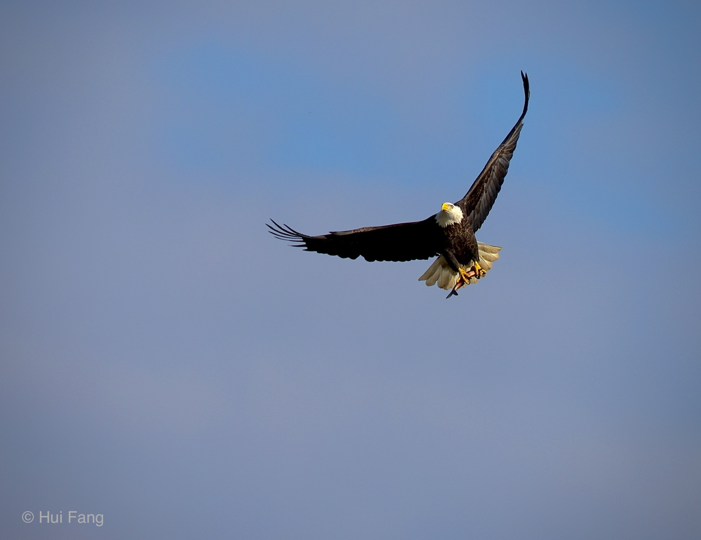
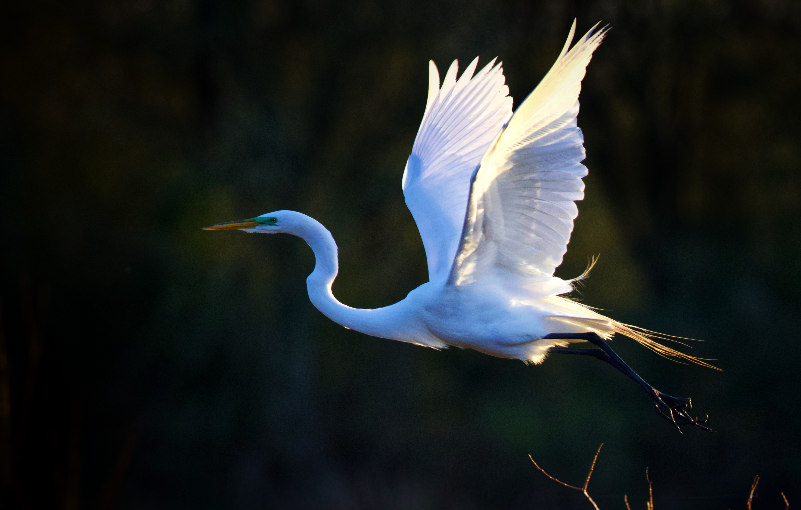

# Discover the Delightful Quirks of My Website 
Prepare to be captivated by the world of my site! Immerse yourself in a vibrant array of content ranging from my cherished hobbies and captivating photos to delectable cooking recipes and handy gardening tips. But that's not all—brace yourself for some exciting surprises! Occasionally, I'll regale you with tales of thrilling adventures, whisk you away to historical and scenic hiking sites, and even share my escapades in wild mushroom hunting. Delving deeper, you'll uncover thought-provoking discussions on research-related subjects and the latest scorching trends in the realm of data science. Your journey through my site promises to be an exhilarating experience!
# Unveiling My Passions and Aspirations
With a background as a trained plant pathologist, my journey has led me to become a risk analyst. My work involves developing survey design tools, conceptualizing innovative survey plans, and meticulously evaluating the effectiveness of these designs. My job also includes data analysis and statistical inference. So, to become a data scientist is my dream.  
Beyond my professional endeavors, my life is an intricate tapestry of passions and pursuits. Cooking, gardening, hiking, running, photography, and playing Ping-Pong fill my leisure hours with boundless joy. Amid these, photography emerges as a cherished cornerstone.
# Photography Is One of My Favorite Hobbies
I love capturing the beauty of the world around me through my camera lens. Whether it’s the vibrant colors of a sunset, the intricate details of a flower, or the majesty of wild animals and insects, I’m always on the lookout for something that catches my eyes. Photography has taught me to observe the world more carefully and appreciate the little moments that make life so special. Sometimes, I’m lucky enough to capture these moments in photos and share them with friends and family. A picture is worth a thousand words, and I believe that photos can tell stories in ways that words cannot. Taking photos has also taught me patience and perseverance; sometimes getting the perfect shot requires hiking long distances or waiting for hours for the right moment. But when I finally get that perfect shot, it’s all worth it. Photography is not just a hobby for me; it’s a way to stay connected with the world around me and improve my physical and mental health.
### Sample Photos
 
